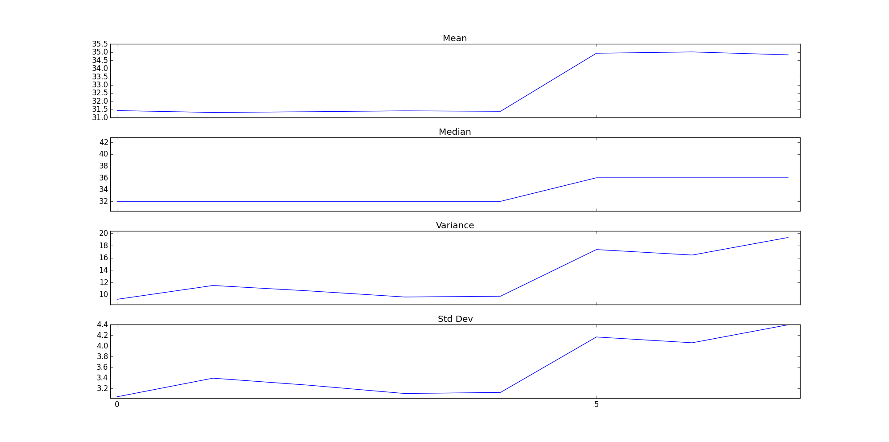
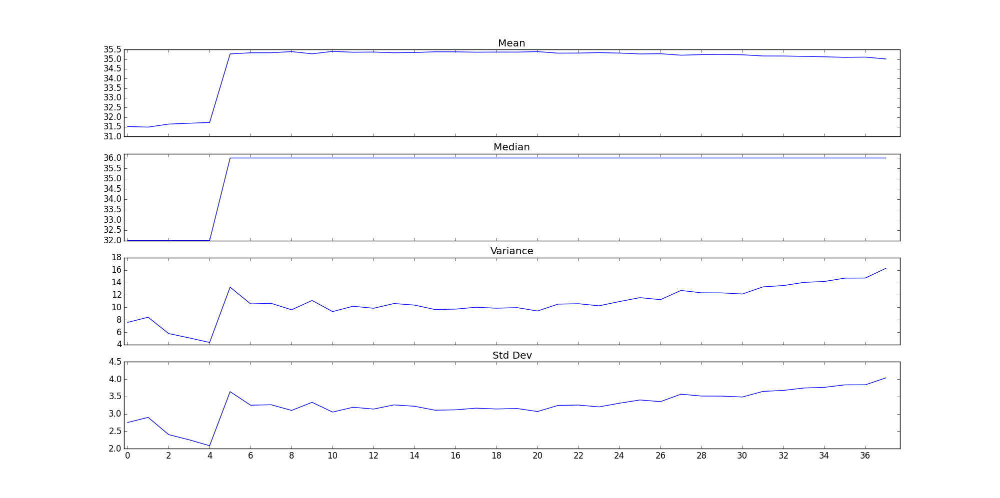
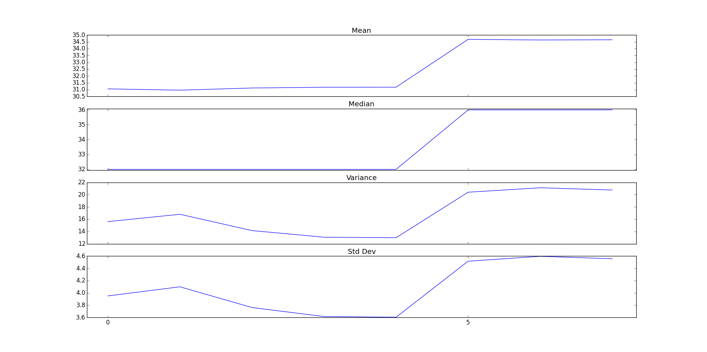
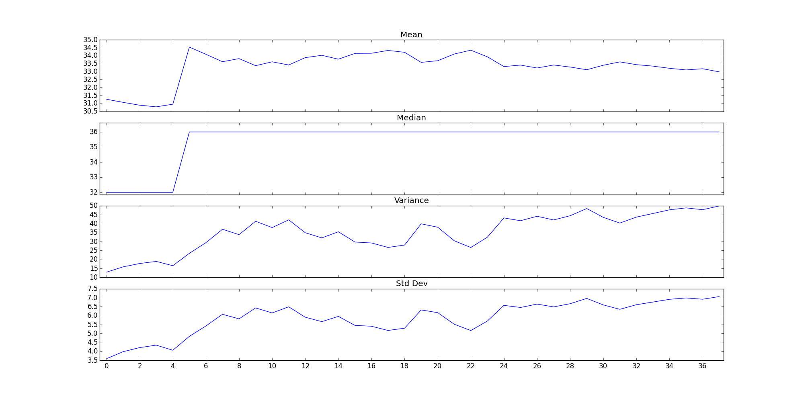

# Per-nuclotide-quality plots
**Index 1**

**Read 1**

**Index 2**

**Read 2**

# 1.2 Eye comparision
By eye the indexs look over all worse, compared to the reads. However they are the same in terms of 1-to-1 nuclotide quality. Its just that the first 4 reads are very poor.

# 3.4 
Think about each quality cutoff used and what those quality scores should mean.  Does removing low quality records proportionally reduce the amount of index swapping?  Does it proportionally reduce the number of “undetermined” index pairs?  Why or why not? 

Removing low quality reads doesn't reduce the proportion of index swaping, this is because the reads are real and are actully good quyality. Its just that they became chimaric when they were amplifiyed. It does however reduce the number of undetermined reads, this is becuase alot of the reads are bad base calls and N's. Removing the low quality reads will tend to remove these reads.